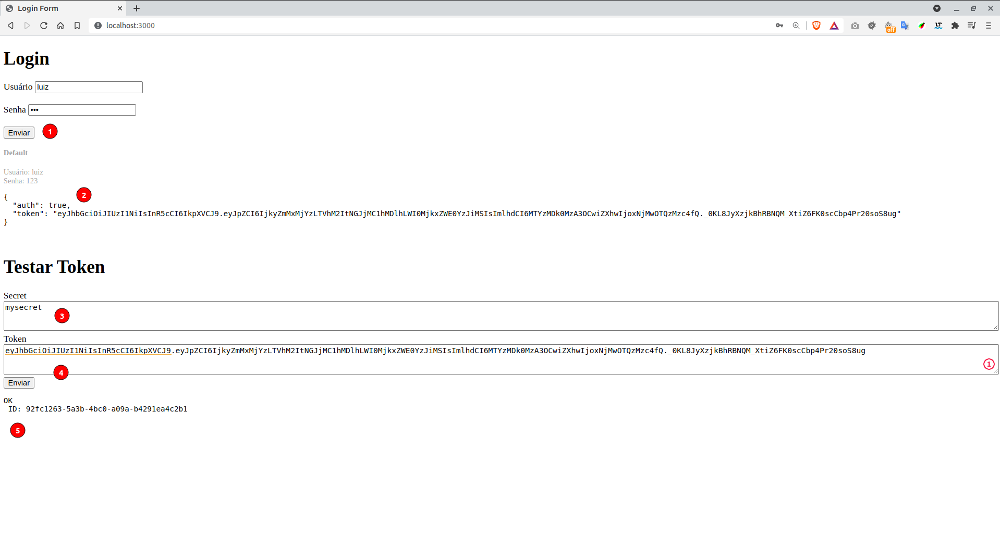
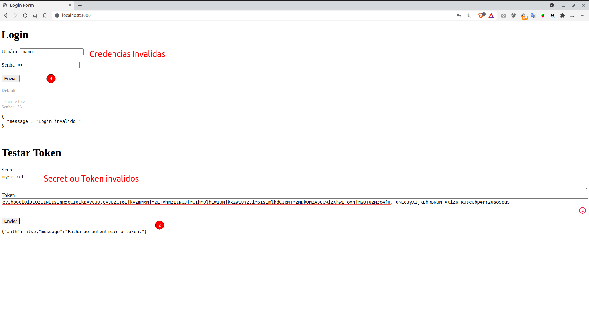

# Node JWT
Testing JWT with Node

# Requirements
1. [Node/NPM](https://nodejs.org/en/download/)

# Setup

```sh
git clone https://github.com/stdioh321/node-jwt.git
cd node-jwt
npm install
```

# Run
```sh
node index.js
```

Open your browser at:

**http://localhost:3000**

|Credencias Ok | Credenciais Invalidas|
|:--:|:--:|
|||

# References
* https://www.luiztools.com.br/post/autenticacao-json-web-token-jwt-em-nodejs/